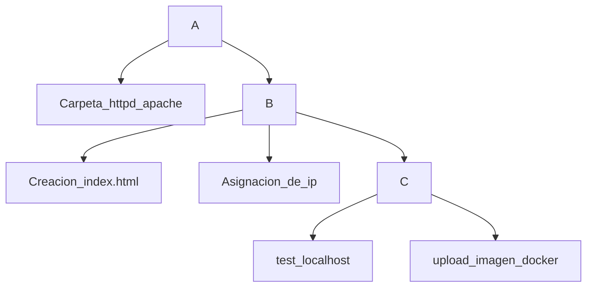

# Taller en Clase

## Integrantes del Grupo 7

| Nombre      | Apellido     |
|-------------|--------------|
| Michelle    | Gutierrez    |
| Harold      | Ramirez      |
| Camilo      | Porras       |

---

## **Descripción del Proyecto**

El objetivo del taller fue implementar un servidor Apache utilizando Docker y configurar el acceso a una página web estática. Este proceso incluyó:

Creación de imágenes Docker personalizadas.
Configuración de una red local con asignación de IPs.
Pruebas de acceso desde el navegador.
Publicación de la imagen en Docker Hub.

## Descripción

**1.**	Creación de una carpeta local con el nombre /apache-cerver-grupo-7/html

 

**2.**	Creación de un archivo de nombre index.html, con el contenido de la pagina

 

 
**3.**	Creación del archivo Dockerfile
El Dockerfile se utilizó para construir la imagen personalizada de Apache:

FROM httpd:latest
COPY ./html /usr/local/apache2/htdocs/

 

**4.**	Construcción de la imagen apache-local con la etiqueta 1.0 haciendo relación a que es la primera versión del archivo

 
**5.**	Asignación de una IP del segmento 10.0.2.0/24, en este caso la 10.0.2.30

 
**6.**	Se accede a la ip en el navegador para confirmar el acceso a la pagina creada

 

**7.**	Se procede a conectarse a Docker Hub para subir la imagen

 

MIT License

Copyright (c) 2024 Grupo 7

Permission is hereby granted, free of charge, to any person obtaining a copy
of this software and associated documentation files (the "Software"), to deal
in the Software without restriction, including without limitation the rights
to use, copy, modify, merge, publish, distribute, sublicense, and/or sell
copies of the Software, and to permit persons to whom the Software is
furnished to do so, subject to the following conditions:
...

