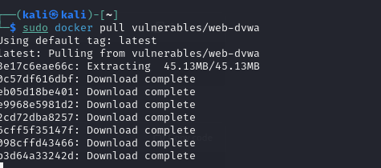
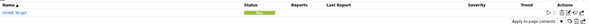

# Escaneo de Vulnerabilidades con OpenVAS - Grupo 6

## Integrantes
1. Erick Celis
2. Diego Sindicue
3. Diego Padilla

## Introducción

Este proyecto consiste en la utilización de la herramienta OpenVAS (Open Vulnerability Assessment System) para analizar vulnerabilidades en una aplicación web vulnerable (`DVWA - Damn Vulnerable Web Application`). Como parte del trabajo, se documentaron los pasos de instalación, configuración y análisis, además de subir la imagen personalizada a DockerHub.

El propósito principal de esta actividad es aprender a identificar vulnerabilidades en entornos controlados y documentar el proceso como referencia para futuras auditorías de seguridad.

## Paso 1: Instalación y Configuración de OpenVAS

1. **Actualizar el sistema operativo:**
   Actualizamos los paquetes del sistema para asegurarnos de contar con las últimas versiones.
   ```bash
   sudo apt-get update && sudo apt-get upgrade -y
   ```
2. **Instalar OpenVAS: Instalamos OpenVAS, que forma parte de gvm**
   ```bash
   sudo apt-get install -y gvm
   ```
   
   
4. **Configurar OpenVAS: Configuramos todos los componentes necesarios, como la base de datos de vulnerabilidades y las dependencias.**
   ```bash
   sudo gvm-setup
   ```
   
5. **Verificar la configuración:**
   Actualizamos los paquetes del sistema para asegurarnos de contar con las últimas versiones.
   ```bash
   sudo gvm-check-setup
   ```
   
6. **Iniciar los servicios:**
   Ejecutamos OpenVAS y accedemos a la interfaz gráfica desde un navegador.
   ```bash
   sudo gvm-start
   ```
   
   
  * URL de acceso: https://localhost:9392
  * Usuario y contraseña: Generados durante la configuración.

  * Vista de Greenbone.  
    

  * Ingresamos con el Usuario y contraseña: Generados durante la configuración.  
    
   
    
## Paso 2: Configuración del Contenedor Vulnerable

1. **Instalar Docker:**  
   Instalamos Docker para gestionar los contenedores.  
   ```bash
   sudo apt-get install -y docker.io
   ```
   

   
2. **Descargar el Contenedor Vulnerable (DVWA):**  
   Utilizamos Docker para descargar la imagen de DVWA desde DockerHub.
   ```bash
   sudo docker pull vulnerables/web-dvwa
   ```
   

   
3. **Ejecutar el Contenedor:**  
   Iniciamos el contenedor en el puerto 8080 para que esté accesible desde el navegador o herramientas de escaneo.
   ```bash
   sudo docker run -d --name dvwa -p 8080:80 vulnerables/web-dvwa
   ```
   
   
5. **Verificar el Contenedor en Ejecución:**  
   Iniciamos el contenedor en el puerto 8080 para que esté accesible desde el navegador o herramientas de escaneo.
   ```bash
   sudo docker ps
   ```
   
   
7. **Obtener la Dirección IP del Contenedor**  
   Si necesitas la dirección IP específica del contenedor para enlazarlo con greenbone con este comando puedes sacarla
   ```bash
   sudo docker inspect -f '{{range.NetworkSettings.Networks}}{{.IPAddress}}{{end}}' dvwa
   ```
   
   
## Paso 3: Crear un Objetivo y una Tarea de Escaneo en OpenVAS

1. **Acceder a la Interfaz Web de OpenVAS:**  
   Abrimos un navegador y accedemos a la interfaz gráfica de OpenVAS.  
   - URL: `https://localhost:9392`  
   - Inicia sesión con las credenciales generadas durante la configuración.

2. **Crear un Objetivo:**  
   Configuramos un nuevo objetivo para el análisis de vulnerabilidades.  
   - Navegamos a `Configuration > Targets`.  
   - Hacemos clic en `New Target`.  
   - Completamos los campos requeridos:
     - **Name:** `DVWA Target`.
     - **Hosts:** Ingresamos la dirección IP del contenedor (`127.0.0.1` o la dirección obtenida con `docker inspect`).
     - **Port List:** Seleccionamos `All IANA Assigned TCP`.  
   - Guardamos el objetivo.
   - Vista del objetivo:  
     
  
3. **Crear una Tarea de Escaneo:**  
   Asociamos el objetivo creado a una nueva tarea de escaneo.  
   - Navegamos a `Scans > Tasks`.  
   - Hacemos clic en `New Task`.  
   - Configuramos los siguientes campos:
     - **Name:** `VWA Scan`.
     - **Target:** Seleccionamos `DVWA Target`.
     - **Scanner:** Dejamos seleccionado `OpenVAS Default`.  
   - Guardamos la tarea.
   - Vista del objetivo:  
     

     

4. **Iniciar el Escaneo:**  
   Ejecutamos la tarea para iniciar el escaneo.  
   - En la lista de tareas (`Scans > Tasks`), localizamos `DVWA Scan`.
   - Hacemos clic en el botón `Play` (▶️) para iniciar el escaneo.
   - Vista del objetivo:  
     
       

5. **Monitorear el Progreso:**  
   Verificamos el estado del escaneo en la columna `Status`.  
   - Los posibles estados son:
     - `Requested`: El escaneo ha sido solicitado.
     - `Running`: El escaneo está en progreso.
     - `Done`: El escaneo ha finalizado.
     - Vista del objetivo:  
     

6. **Revisar los Resultados del Escaneo:**  
   - Una vez completado el escaneo, vamos a `Scans > Reports`.  
   - Seleccionamos el informe asociado a `DVWA Scan`.  
   - Descargamos el informe en formato PDF, HTML o XML para análisis posterior.
   - Vista del objetivo:  
     
     
     


## Paso 4: Análisis de Vulnerabilidades Detectadas

Durante el escaneo realizado con OpenVAS sobre el contenedor DVWA, se identificaron **18 vulnerabilidades** de un total de 54 pruebas realizadas. A continuación, se detallan las más relevantes clasificadas por severidad y con sus respectivas recomendaciones:

---

### **Vulnerabilidades Detectadas**

1. **Operating System (OS) End of Life (EOL) Detection**  
   - **Severidad:** Alta.  
   - **Descripción:** El sistema operativo del servidor está obsoleto y ya no recibe actualizaciones ni parches de seguridad, lo que aumenta la exposición a ataques.  
   - **Recomendación:** Actualizar a una versión soportada del sistema operativo.

2. **Missing HttpOnly Cookie Attribute (HTTP)**  
   - **Severidad:** Media.  
   - **Descripción:** Las cookies críticas no tienen configurado el atributo `HttpOnly`, lo que permite que puedan ser accedidas mediante scripts maliciosos.  
   - **Recomendación:** Configurar el atributo `HttpOnly` en las cookies para protegerlas contra accesos no autorizados.

3. **Cleartext Transmission of Sensitive Information via HTTP**  
   - **Severidad:** Media.  
   - **Descripción:** Información sensible está siendo transmitida sin cifrado utilizando el protocolo HTTP en lugar de HTTPS.  
   - **Recomendación:** Habilitar HTTPS y asegurarse de que todas las transmisiones de datos estén cifradas.

4. **TCP Timestamps Information Disclosure**  
   - **Severidad:** Baja.  
   - **Descripción:** Los sellos de tiempo TCP están habilitados, permitiendo a los atacantes estimar el tiempo de actividad del servidor y realizar ataques de cronometraje.  
   - **Recomendación:** Deshabilitar los sellos de tiempo TCP si no son necesarios.

5. **HTTP Server Banner Enumeration**  
   - **Severidad:** Baja.  
   - **Descripción:** El servidor está revelando información sobre su versión a través de los encabezados HTTP.  
   - **Recomendación:** Configurar el servidor para ocultar la información de su versión en los encabezados.

---

### **Resumen de Severidad**

- **Alta:** 1 vulnerabilidad crítica requiere atención inmediata.  
- **Media:** 2 vulnerabilidades de riesgo moderado deben ser corregidas en un plazo razonable.  
- **Baja:** 2 vulnerabilidades menores pueden ser abordadas en futuras revisiones.

---

### **Recomendaciones Generales**

1. **Actualizar el Sistema Operativo y Aplicaciones:**  
   - Mantener todos los componentes actualizados para minimizar riesgos por exploits conocidos.

2. **Implementar Cifrado:**  
   - Configurar HTTPS y certificados SSL/TLS para proteger la transmisión de datos.

3. **Mejorar la Configuración de Seguridad de Cookies:**  
   - Añadir los atributos `HttpOnly` y `Secure` para proteger cookies sensibles.

4. **Fortalecer la Seguridad del Servidor:**  
   - Ocultar información del servidor y deshabilitar configuraciones innecesarias como los sellos de tiempo TCP.

---

### **Conclusión**

El análisis realizado permitió identificar y documentar vulnerabilidades críticas, medias y bajas. Como grupo de trabajo, hemos propuesto medidas específicas y generales para mitigar estos riesgos y mejorar la postura de seguridad de la aplicación.

## Paso 5: Subir la Imagen Escaneada a DockerHub

1. **Verificar que el Contenedor está en Ejecución:**  
   Antes de subir la imagen, confirmamos que el contenedor vulnerable está corriendo correctamente.  
   ```bash
   sudo docker ps
   ```
   
   
3. **Crear una Nueva Imagen Basada en el Contenedor Escaneado:**  
   Creamos una nueva imagen del contenedor dvwa escaneado y le asignamos un nombre descriptivo. 
   ```bash
   sudo docker commit dvwa grupo6/dvwa_vulnerable
   ```
   
   
5. **Etiquetar la Imagen para DockerHub:**  
   Asignamos una etiqueta a la imagen para que coincida con el repositorio de DockerHub. Asegurense de usar su nombre de usuario en dockerhub.
   ```bash
   sudo docker tag grupo6/dvwa_vulnerable erickc09/dvwa_vulnerable:v1
   ```
   
   
7. **Iniciar Sesión en DockerHub:**  
   Nos autenticamos en DockerHub con nuestras credenciales.
   ```bash
   sudo docker login
   ```
   
   
9. **Subir la Imagen a DockerHub:**  
   Subimos la imagen etiquetada a nuestro repositorio en DockerHub.
   ```bash
   sudo docker push erickc09/dvwa_vulnerable:v1
   ```

   
   


