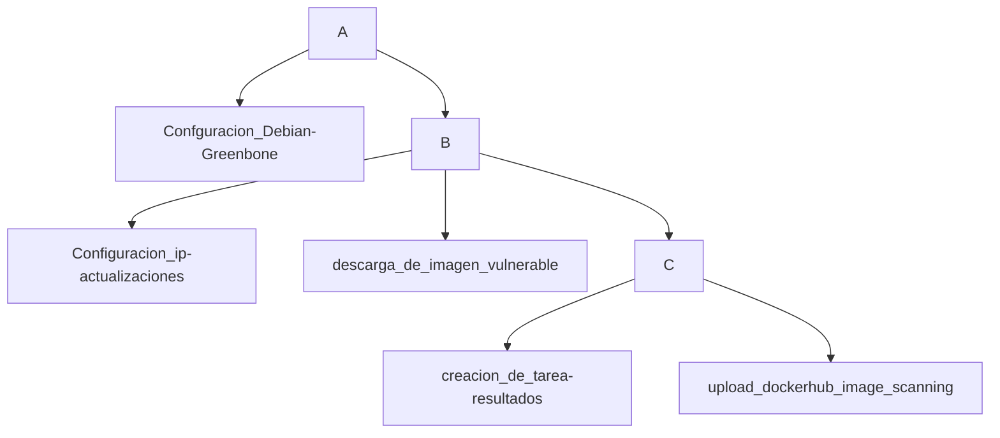

# **Reporte: Taller de Contenerización y Escaneo de Vulnerabilidades con OpenVAS**

## **Integrantes del Grupo 7**

| Nombre      | Apellido     |
|-------------|--------------|
| Michelle    | Gutierrez    |
| Harold      | Ramirez      |
| Camilo      | Porras       |

## Descripción


## **Objetivo del Taller**

El objetivo del taller fue crear y configurar un contenedor Docker con OpenVAS, realizar un escaneo de vulnerabilidades en un sistema vulnerable, y documentar todo el proceso, incluyendo la creación, actualización y análisis de vulnerabilidades. Este ejercicio también incluye la configuración de un contenedor vulnerable, el escaneo de red, y la creación de tareas programadas dentro del contenedor de OpenVAS.

---

## **Proceso de Creación del Contenedor con OpenVAS**

### **Paso 1: Creación de la Máquina Virtual Ubuntu**

Se comenzó con la creación de una máquina virtual Ubuntu, que serviría como base para la instalación de Docker y otros componentes necesarios para el taller.

1. **Instalación de Ubuntu**:
   - Se descargó la imagen ISO de Ubuntu desde su sitio oficial.
   - **Captura de pantalla**: Se muestra la máquina virtual recién creada con Ubuntu.

   

### **Paso 2: Instalación de Docker en Ubuntu**

Para la instalación de Docker en Ubuntu, se siguieron los siguientes pasos:

1. **Instalación de Docker**:
   - Ejecutamos los siguientes comandos para instalar Docker:
     ```bash
     sudo apt-get update
     sudo apt-get install -y docker.io
     ```
   - Verificamos la instalación con:
     ```bash
     docker --version
     ```

   

### **Paso 3: Descargar la Imagen de OpenVAS**

Usamos el comando Docker para descargar la imagen de OpenVAS (Greenbone Vulnerability Management).

1. **Comando para descargar la imagen**:
   ```bash
   docker pull greenbone/gvm
   ```

   

### **Paso 4: Crear el Contenedor Docker con OpenVAS**

Después de descargar la imagen de OpenVAS, creamos el contenedor asignándole una IP válida dentro del segmento local y configurando el puerto para acceder a la interfaz web de OpenVAS.

1. **Comando para crear el contenedor**:
   ```bash
   docker run -d --name openvas -e PASSWORD=admin -p 443:443 greenbone/gvm
   ```

   

---

## **Configuración y Ejecución de un Repositorio Vulnerable**

### **Paso 5: Descargar un Repositorio Vulnerable**

Para realizar pruebas de escaneo, se descargó un repositorio vulnerable, como el proyecto DVWA (Damn Vulnerable Web Application), que se ejecutaría en un contenedor Docker.

1. **Captura de pantalla de la descarga del repositorio vulnerable**:

   

### **Paso 6: Ejecutar el Repositorio Vulnerable**

1. **Ejecutar el contenedor con el repositorio vulnerable**:
   ```bash
   docker run -d --name vulnerable-repo --network host vulnerable/repo
   ```

   

### **Paso 7: Acceder al Contenedor Vulnerable**

Una vez el contenedor vulnerable estaba en ejecución, accedimos al repositorio desde un navegador para verificar que estuviera disponible y listo para ser escaneado.

1. **Acceso al contenedor vulnerable**:
   - Abrimos el navegador e ingresamos la IP del contenedor vulnerable.
   - **Capturas de pantalla de la interfaz del repositorio vulnerable**:

   


---

## **Escaneo de Vulnerabilidades con OpenVAS**

### **Paso 8: Configuración de OpenVAS**

1. **Acceder a la interfaz web de OpenVAS**:
   - Accedimos a la interfaz de OpenVAS a través del navegador, usando la dirección `https://<ip_del_contenedor>:443`.
   - Configuramos el escaneo especificando los parámetros necesarios y seleccionamos el perfil de escaneo más adecuado.
  
   

   

   

### **Paso 9: Realizar el Escaneo de Vulnerabilidades**

1. **Iniciar el escaneo**:
   - Iniciamos el escaneo del contenedor vulnerable utilizando la interfaz web de OpenVAS.
   - **Captura de pantalla de los resultados del escaneo**:

   

   


---

### **Paso 10: Analisis de vulneravilidades**

1. **Subir la imagen de OpenVAS a DockerHub**:
   - Podemos observar 5 vulneravulidades, una alta, 2 medias y 2 bajas

   

   - Si ampliamos la informacion podemos ver el detalle de la vulnerabilidad.
  
   

   

   - Adicional podemos observar con detalle los CVE del escaneo realizado
  
   


## **Conclusión**

Este taller permitió la creación y configuración de un contenedor Docker con OpenVAS, así como la realización de un escaneo de vulnerabilidades sobre un sistema vulnerable. Se cubrieron todos los pasos necesarios, desde la creación de la máquina virtual hasta la subida de la imagen a DockerHub, asegurando que el proceso estuviera bien documentado y que los resultados del escaneo fueran correctamente registrados. 

Este ejercicio no solo facilita el entendimiento del uso de OpenVAS en contenedores Docker, sino también el análisis y gestión de vulnerabilidades en entornos controlados.
